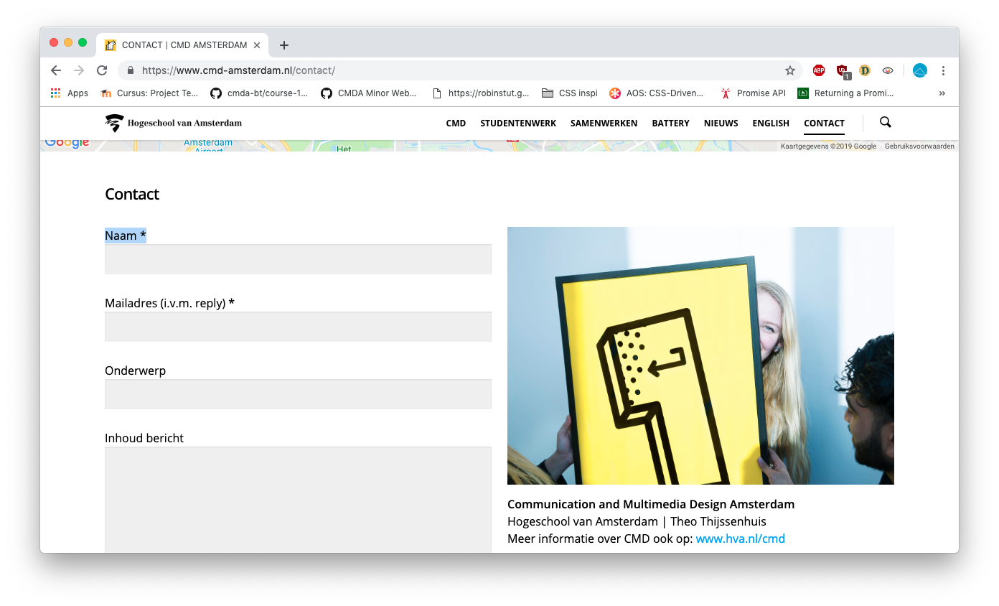
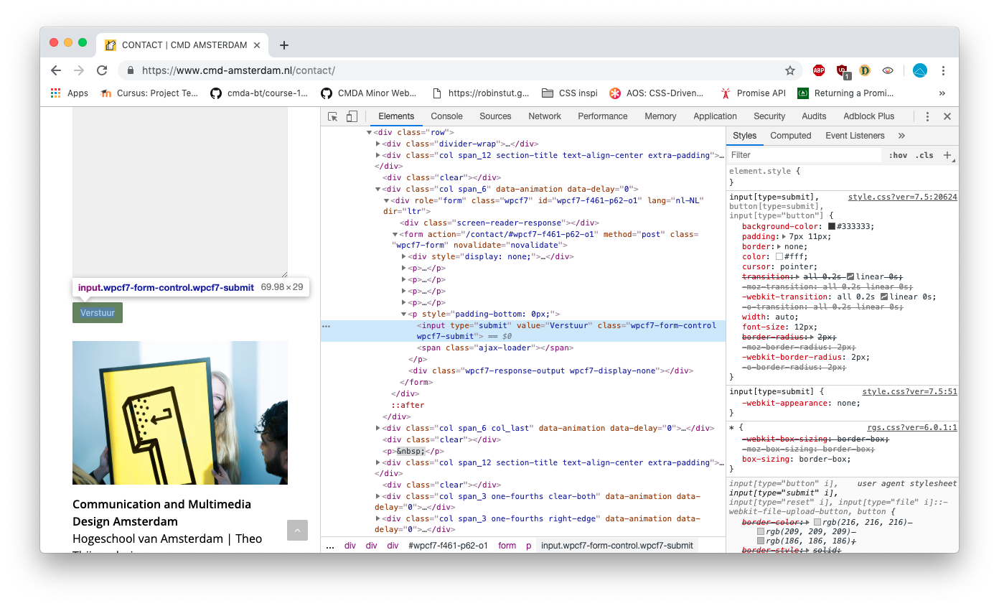
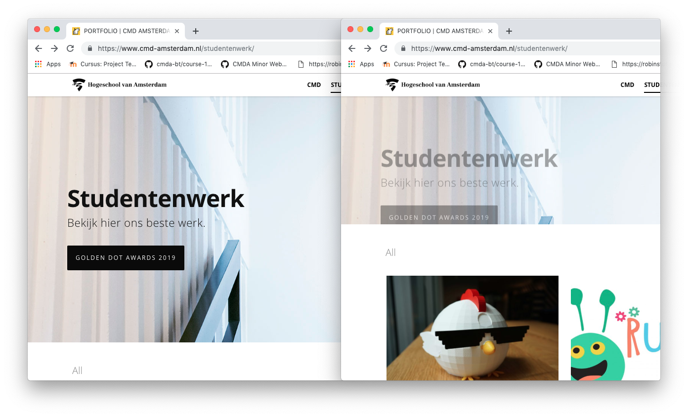
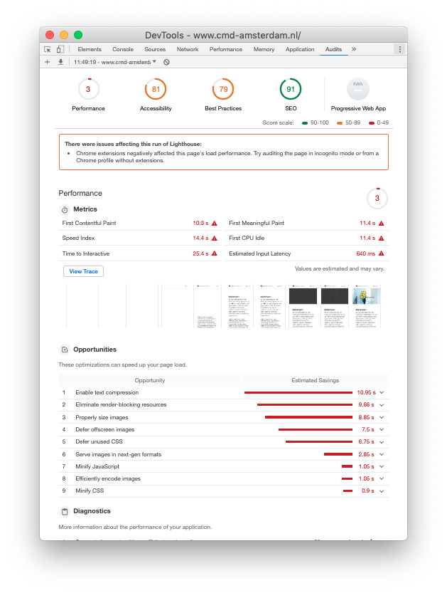

# Project 2 @cmda-minor-web · 2018-2019

## Bevindingen van 

Op maandag 1 april is er een briefing gegeven over de website van . 4 jaar geleden is er gekozen voor een Wordpress website, zodat de content makkelijk in te vullen is voor mensen met weinig technische kennis. De Look & Feel van de website geven een Wordpress gevoel, waar misschien een persoonlijke sfeer wat passender kan zijn. De website scoort enorm slecht op de performance, er zijn veel afbeeldingen ingeladen op elke pagina. De website is ook semi responsive, alles schaalt mee maar niet optimaal voor alle situaties.

### Enkele mogelijke verbeterpunten:

<pre>
Afbeeldingen worden allemaal ingeladen, zonder dat ze al te zien zijn. Hierdoor wordt er langer geladen.
</pre>

 

<pre> Labels zijn niet gekoppeld aan de input velden, waardoor screenreaders moeite hebben met invullen. Ook buttons worden door screenreaders herkent als normale tekst.
</pre>

 <pre>De belangrijkste knop op de pagina's zijn alleen zichtbaar als er nog niet gescrolled is.
 </pre>

 <pre>
 De resultaten van de performance check van Autits geeft aan dat er op meerdere vlakken veel verbeterd kan worden.
 </pre>
