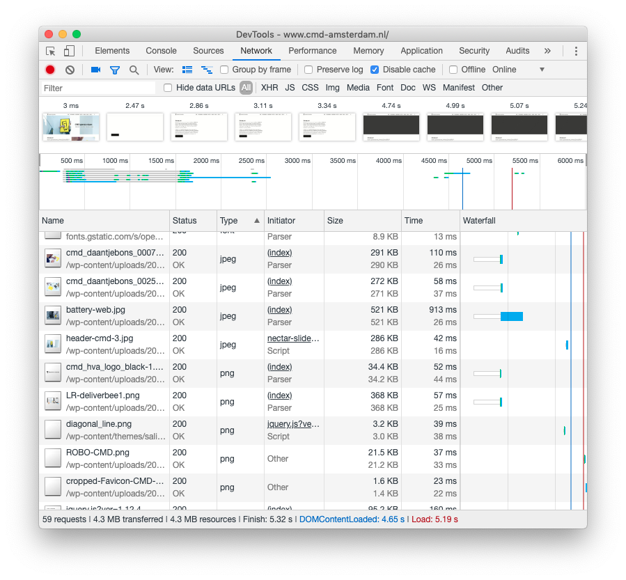

# Project 2 @cmda-minor-web · 2018-2019

## Bevindingen van 

Op maandag 1 april is er een briefing gegeven over de website van . 4 jaar geleden is er gekozen voor een Wordpress website, zodat de content makkelijk in te vullen is voor mensen met weinig technische kennis. De Look & Feel van de website geven een Wordpress gevoel, waar misschien een persoonlijke sfeer wat passender kan zijn. De website scoort enorm slecht op de performance, er zijn veel afbeeldingen ingeladen op elke pagina. De website is ook semi responsive, alles schaalt mee maar niet optimaal voor alle situaties.

### Enkele mogelijke verbeterpunten:

<pre>
Afbeeldingen worden allemaal ingeladen, zonder dat ze al te zien zijn. Hierdoor wordt er langer geladen.
</pre>

<pre> Labels zijn niet gekoppeld aan de input velden, waardoor screenreaders moeite hebben met invullen. Ook buttons worden door screenreaders herkent als normale tekst.
</pre>

 <pre>De belangrijkste knop op de pagina's zijn alleen zichtbaar als er nog niet gescrolled is.
 </pre>

 <pre>
 De resultaten van de performance check van Autits geeft aan dat er op meerdere vlakken veel verbeterd kan worden.
 </pre>

## Wat ik verbeterd heb:

Tijdens het bedenken van een idee voor de verbeteringen aan de website van [CMD](https://www.cmd-amsterdam.nl/) heb ik ervoor gekozen om gedeeltelijk de website opnieuw te bouwen. Wat voor mij belangrijk was is dat de opdrachtgever Mattijs momenteel de content op Wordpress weet te plaatsen met een “WYSIWYG” editor. Samen met enkele andere beheerders is het dus mogelijk om zeer eenvoudig de content te kunnen beheren. Helaas zorgt de “WYSIWYG” editor ervoor dat de website slecht scoort op toegankelijkheid en performance. Waar ik aan gewerkt heb de afgelopen week in samenwerking met [Jesse Dijkman](https://github.com/jesseDijkman1/) is om de content dynamisch in te laden in node.js. We hebben diverse stukken code (regEx) geschreven die de ingeladen content van cmd Amsterdam leeg trekken, waardoor we een nette versie krijgen van de html die op de website zichtbaar is. Het voordeel van deze mannier van werken is dat er voor de content beheerders niks veranderd, de content die geplaatst of aangepast wordt is direct up-to-date in het prototype wat uitgewerkt is.

De huidige performance van CMD:

De performance van mijn prototype:

### Wat is er beter:

##### De score op Performance

- Doordat de css opnieuw is opgebouwd, is de css van +/- 21.000 regels naar +/- 500 regels gegaan.
- Er is gebruikt gemaakt van lazy loading, wat er voor zorgt dat alleen de zichtbare afbeeldingen eerst ingeladen worden. Dit versnelt de laadtijd.
- Er wordt momenteel geen gebruik gemaakt van plugins, waardoor de laadtijd verbeterd is.
- Er is gebruikt gemaakt van Compression, wat er voor zorgt dat de content zo klein mogelijk wordt qua grootte. Hierdoor laadt de pagina sneller.

##### De score op Accessibility

- De META data is correct ingesteld, wat er voor zorgt dat de pagina naar de juiste verhoudingen schaalt.
- Er zijn labels gemaakt op plekken zoals contactformulieren. Het voordeel hiervan is dat een screenreader de content correct kan voorlezen.
- Alle content is ingedeeld per stukje, dit zorgt ervoor dat iemand zich bezig houdt met de html een betere structuur voorgeschoteld krijgt.
- Alle content die geen html tag hadden, heb ik een tag gegeven. Dit zorgt ervoor dat de tekst de styling aanneemt die het had moeten hebben en dat de tekst correct gelezen wordt door screenreaders.

##### De score op SEO

- De META data is correct ingesteld, wat er voor zorgt dat de website eerder gevonden wordt door zoekmachines.

##### Wat ik nog had willen doen:

- [ ] Alle vreemde characters van de pagina verwijderen
- [ ] De styling wat meer personaliseren tot CMD
- [ ] Meer kijken naar responsive ontwerp.

### Het prototype

[Website prototype](http://p2stut.herokuapp.com)

In samenwerking met:

- [Jesse Dijkman](https://github.com/jesseDijkman1/)
